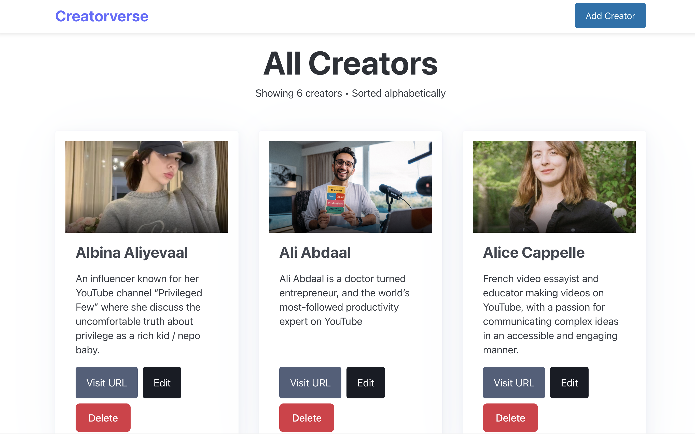
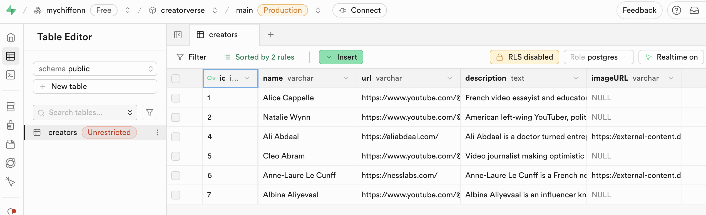

# WEB103 Prework - Creator 




Submitted by: Tra My (Chiffon) Nguyen

About this web app: Database of YouTub creators, particularly productivity experts and video essayists

Time spent: 3 hours

## Required Features

The following **required** functionality is completed:

- [x] **A logical component structure in React is used to create the frontend of the app**
- [x] **At least five content creators are displayed on the homepage of the app**
- [x] **Each content creator item includes their name, a link to their channel/page, and a short description of their content**
- [x] **API calls use the async/await design pattern via Axios or fetch()**
- [x] **Clicking on a content creator item takes the user to their details page, which includes their name, url, and description**
- [x] **Each content creator has their own unique URL**
- [x] **The user can edit a content creator to change their name, url, or description**
- [x] **The user can delete a content creator**
- [x] **The user can add a new content creator by entering a name, url, or description and then it is displayed on the homepage**

The following **optional** features are implemented:

- [x] Picocss is used to style HTML elements
- [x] The content creator items are displayed in a creative format, like cards instead of a list
- [x] An image of each content creator is shown on their content creator card

The following **additional** features are implemented:

* [x] Sticky header and persistent footer across pages

## Video Walkthrough

For a walkthrough of implemented required features, please go to [https://i.imgur.com/TadBtz2.mp4](https://i.imgur.com/TadBtz2.mp4).

A look into the database on Supabase



## Notes

CRUD logic (fetching/adding/editing/removing a creator) is in [services.ts](./src/services.ts).

## Getting Started

- Node.js >= 22 (tested with Node 24)
- npm/yarn/pnpm/bun package manager. pnpm recommended.

1. **Clone the repository**
   ```bash
   git clone https://github.com/mychiffonn/creatorverse
   cd creatorverse
   ```

2. **Install dependencies**
   ```bash
   pnpm install
   ```

3. **Configure Supabase**
   - Create a `.env` file in the root directory
   - Add your Supabase API key:
     ```
     VITE_SUPABASE_KEY=your_supabase_key_here
     ```
   - Update the Supabase URL in [services.ts](./src/services.ts)

4. **Start the development server**
   ```bash
   pnpm dev
   ```

5. Navigate to `http://localhost:5173` in the browser (or the port shown in terminal)

## License

Copyright 2025 My (Chiffon) Nguyen

Licensed under the Apache License, Version 2.0 (the "License"); you may not use this file except in compliance with the License. You may obtain a copy of the License at

> http://www.apache.org/licenses/LICENSE-2.0

Unless required by applicable law or agreed to in writing, software distributed under the License is distributed on an "AS IS" BASIS, WITHOUT WARRANTIES OR CONDITIONS OF ANY KIND, either express or implied. See the License for the specific language governing permissions and limitations under the License.
